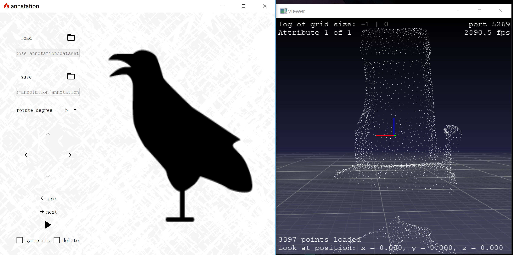

# 6d-pose-annotation-tool
--------------------------

A naive tool for 6d-pose annotation on PyQt5 platform.



## Requirements
-----------------------
* PyQt5
* pptk
  
## Shortcut
---

key | description
:-: | :-: 
W | Up
A | left 
S | Down 
D | Right
P | Symmetric 
Del | Delete Point cloud
L | Next
K | Pre

## Dataset
---
Expected structure of 3d point cloud dataset:
```
└─dataset
    ├─scene0
    |   ├─instance_0.npy
    |   ├─instance_1.npy
    |   ├─...
    |   └─instance_n.npy
    ├─scene1
    |   └─...
    ├─...
    └─scenek
```

